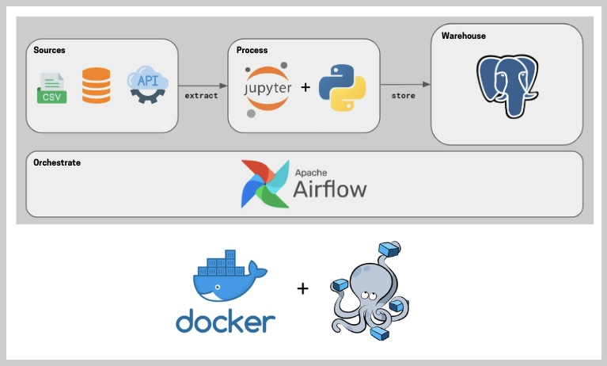

# ETL-Clima-ElSalvador 


Este ETL utiliza Apache Airflow para automatizar la recopilación de datos meteorológicos, transformarlos y cargarlos en una base de datos PostgreSQL. Se utilizan tres tareas principales en un DAG para procesar datos de la API de OpenWeatherMap, almacenarlos en Google Cloud Storage y luego cargarlos en una base de datos para análisis posterior.

## Tareas del DAG
1. Obtener Clima (obtener_clima): Esta tarea llama a la API de OpenWeatherMap para obtener datos meteorológicos en tiempo real para una ubicación específica, en este caso, "San Salvador, SV". Los datos se almacenan localmente y luego se cargan en Google Cloud Storage.
2. Transformar Datos (transfor_data): Esta tarea toma los datos en formato JSON almacenados en Google Cloud Storage, los transforma y los guarda en formato CSV en el mismo almacenamiento.
3. Cargar Tabla (subiendo_tabla): La última tarea toma el archivo CSV generado y carga los datos en una tabla PostgreSQL para hacerlos accesibles para consultas y análisis futuros.

## Configuración del DAG
El DAG está configurado para ejecutarse diariamente a medianoche, asegurando que los datos estén siempre actualizados. No realiza ejecuciones retrospectivas gracias a la configuración de catchup=False.

## Ejecución y Monitoreo
El proyecto está diseñado para ser monitoreado y administrado a través de la interfaz web de Airflow, donde los usuarios pueden visualizar el progreso del DAG, revisar logs y diagnosticar problemas en la ejecución de las tareas.

## Prerrequisitos y Configuración
Asegúrate de tener configuradas las credenciales de Google Cloud para acceder a Google Cloud Storage y las credenciales para la base de datos PostgreSQL. También es necesario definir las variables de entorno como la API key de OpenWeatherMap en Airflow. <br>
Ejemplo: 

## Registro de la clave API de Open Weather como variables de Airflow
Registrese a una cuenta gratuita en https://openweathermap.org/api y obtenga la clave API.

En la interfaz de usuario de Airflow, vaya al menú Admin --> Variables y cree una nueva variable.

Rellene con estos valores:

``` 
key = OPEN_WEATHER_API_KEY
value = <su-llave-API> 
```
<br>

En mi caso yo cree una imagen en  Docker por lo que le recomiendo que lea la documentacion de Apache Airflow. https://airflow.apache.org/docs/apache-airflow/stable/howto/docker-compose/index.html

Despues de leer la documentacion todo lo demas es pan comido, debe crear la base de datos en postgres y su Bucket en Google Cloud (si es que usa la plataforma de Google). <br>
NOTA: Recuerde que debe crear Variables de la base de datos y el bucket de su proyecto de google cloud todo eso debe escribir en la plataforma de Airflow. 



